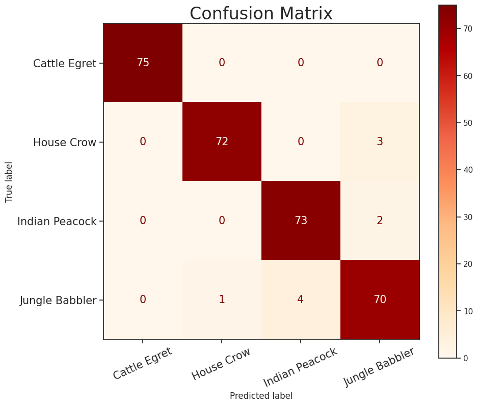
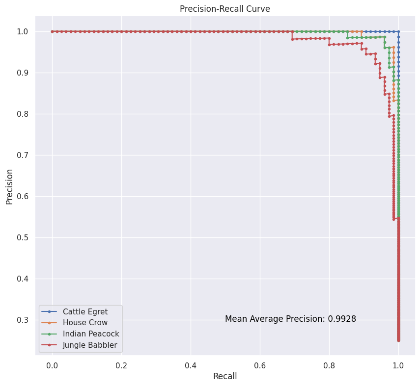
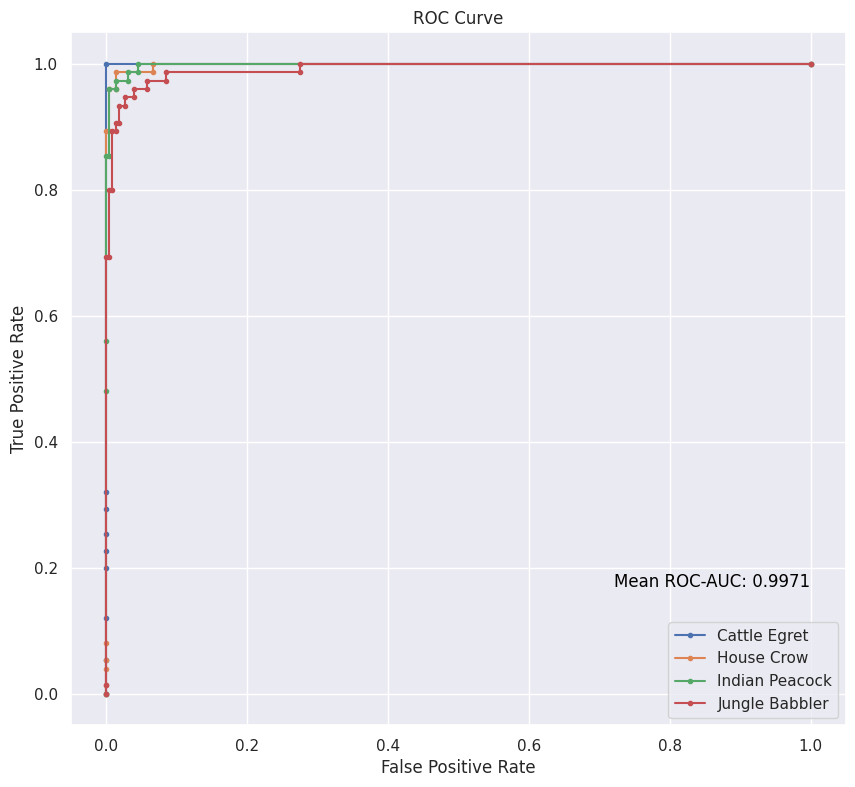

# InceptionNet-Implementation

 
 

Welcome to the InceptionNet implementation repository! Here, you'll find an implementation of the InceptionNet architecture using TensorFlow. InceptionNet is a groundbreaking deep convolutional neural network known for its efficient use of multiple filter sizes in parallel, enabling it to achieve impressive accuracy on image recognition tasks.

## What is InceptionNet?
InceptionNet is a convolutional neural network architecture introduced by Google researchers in their paper "Going Deeper with Convolutions" (2014). It is notable for its inception modules, which consist of parallel convolutional filters of different sizes. This design allows the network to capture features at multiple scales efficiently. InceptionNet has been influential in the development of state-of-the-art computer vision models.

## Features
* Implementation of the InceptionNet architecture from scratch using TensorFlow and Keras.
* Pre-trained InceptionNet models for image recognition tasks.   [`InceptionNet-Weights.h5`](https://www.dropbox.com/scl/fi/up2wcsq9qmd1rmi37my1c/InceptionNet-Weights.h5?rlkey=2hvqkb1p52qam4o58a83sdu6x&dl=0)
* User-friendly API for training, testing, and evaluating the InceptionNet model.
* Code to visualize and analyze model performance using the confusion matrix, Precision-Recall, and ROC-AUC curves.

## Matrices
The accuracy of our model (i.e., InceptionNet-V3) on Testing Data (which contains 75 images belonging to 4 classes each) is **97%** over 100 epochs.

### Confusion Matrix

### Precision-Recall Curve
_Mean Average Precision (mAP) is **0.9928**_

### ROC-AUC Curve
_Area under the ROC Curve is **0.9971**_

